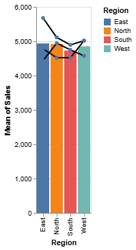
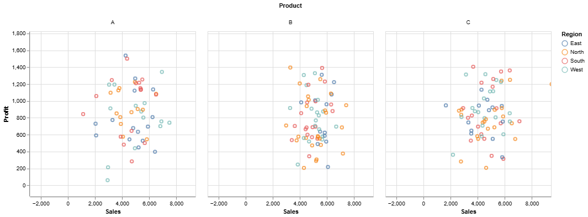
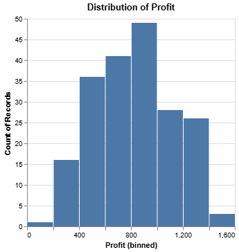

<div align="center">

<h1 align="center">Altair Study Project</h1>

<p align="center">
    <strong>Technology study using Altair</strong>
</p>

[](./README.md)

</div>

## Table of Contents

- [Project Description](#table-of-contents)
- [About](#about)
- [Installation](#installation)
- [Technologies Used](#technologies-used)
- [Visualizations](#visualizations)
- [Data Sources](#data-sources)
- [License](#license)
- [Contact](#contributing)

## Project Description

This project is a practical study focused on data exploration and visualization using the Altair library. The primary goal is to enhance my skills in **Exploratory Data Analysis (EDA)**, transforming raw data into declarative, interactive, and informative visualizations.

I used the **Pandas** and **NumPy** libraries for data manipulation and preprocessing, which were essential for preparing the dataset for visual analysis. 

This project serves as a portfolio piece, demonstrating my ability to use modern data visualization tools to tell stories and extract value.

## Technologies Used

- **Python** - Programming language
- **Altair** - Data visualization library
- **Pandas** - Library for data manipulation and analysis
- **Numpy** -  Array data structure
- **Jupyter** Notebooks- Development environment

## Installation

1. Clone the repository

```bash
git clone https://github.com/Caio-GBrayner/Data_Science_Altair
cd Data_Science_Altair
```

2. Create and activate a virtual environment (recommended):

```bash
python -m venv venv
# On Windows:
venv\Scripts\activate
# On macOS/Linux:
source venv/bin/activate
```

3. Install dependencies:

```bash
pip install -r requirements.txt
```

## Usage

- To run the notebook:

```bash
jupyter notebook
```
(Or `jupyterLab` if applicable)

- Navigate to the main notebook (e.g., **altair.ipynb**) and execute the cells to see the code and visualizations.

## Visualizations

1. Some examples of graphs






## Data Sources

- The Dataframe was created in code for study use only

## License

This project is licensed under the MIT [License](LICENSE). See the LICENSE file for more details.

## Contact

- Caio Gomes Brayner
- Caio Brayner [LinkedIn](https://www.linkedin.com/in/caiogomesbrayner).
- E-mail: caiogomesbrayner@outlook.com